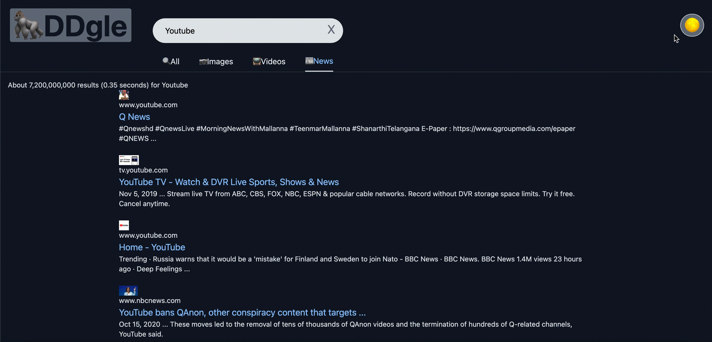

# DDgle

This project is a Search Engine made using React Hooks, Google's [Custom Search API](https://developers.google.com/custom-search/v1/overview) and styled using [Tailwind CSS](https://tailwindcss.com). 

## Prerequisite

- Node.js
- npm or yarn

## Demo

A fully usable version of the app is hosted [here](https://thecryptochad.github.io/DDgle/).

## Installation

In order to run this app locally you must first clone the repository with:
```sh
git clone https://github.com/TheCryptoChad/DDgle.git
```

Then, navigate inside the directory and install the necessary dependencies with:
```sh
npm install
```

Finally, you can run the app with:
```sh
npm start
```

## Features

- ### Search Filters

The app is capable of searching for results based on user input, and filtered by `All`, `Images`, `Videos`, and `News` in order to provide what the user is looking for.
```js
const location = useLocation();

  useEffect(() => {
    if(searchTerm !== ''){
      if(location.pathname === '/videos') {
        getResults(`q=${searchTerm} videos`);
      } else if(location.pathname === '/news') {
        getResults(`q=${searchTerm} news`);
      } else {
        getResults(`/${location.pathname}/q=${searchTerm}`);
      }
    }
  }, [searchTerm, location.pathname]);
```


- ### Dark Mode

The `DarkMode` button allows for a change in React State which triggers the pallet swap. Dark Mode is on by default.



- ### API Calls

Google's Custom Search API is called upon typing a `searchTerm`, which will provide an array of results based on the applied filter, which can then be displayed.
```js
const getResults = async (type) => {
        setIsLoading(true);
        
        const { data } = await axios.get(
          `https://www.googleapis.com/customsearch/v1?key=${process.env.REACT_APP_API_KEY}&cx=${process.env.REACT_APP_ENGINE_KEY}&`,
          {
            params: {
              q: type,
            },
          }
        );
        setResults(data);
        setIsLoading(false);
    };
``` 
